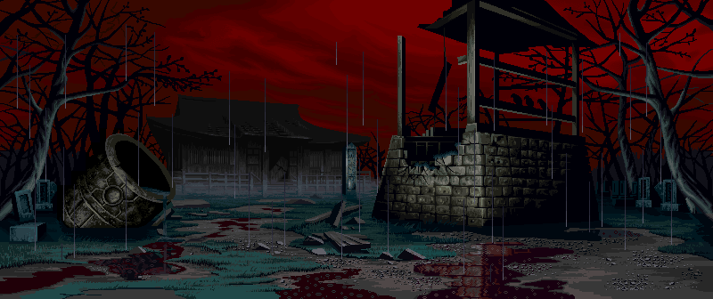
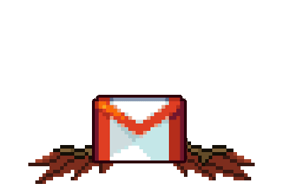
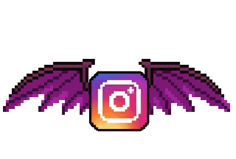
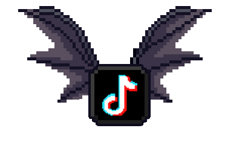

# SHOOT A DM — Interactive Mini Game
## Claude Code Build Specification

---

## PROJECT OVERVIEW

Build a self-contained, embeddable browser mini game for an apparel designer/streetwear brand owner (Edgar Cielos). It lives at the bottom of his portfolio site as a "contact" section styled as an 8-bit shooter. Users aim a crosshair at flying bat-winged social media icons and click to open those social links. The entire game is a single `index.html` + `assets/` folder deployed to GitHub Pages and embedded via iframe in Readymag.

**No frameworks. No build tools. No npm. Vanilla HTML5 + CSS + JS only.**

---

## FINAL DELIVERABLE STRUCTURE

```
edgar-shootdm/
├── index.html          ← entire game lives here
└── assets/
    ├── border total.gif      ← full decorative frame overlay (pre-animated, includes right panel with 8bit Edgar, EKG, messages)
    ├── background.gif        ← 8-bit gothic scene, tiles the game viewport
    ├── border.png            ← secondary border graphic
    ├── edgar.gif             ← 8-bit Edgar avatar (backup, may not be needed if border total.gif covers it)
    ├── ekg.gif               ← heartbeat animation (backup, same)
    ├── frames.png            ← right panel frame (backup, same)
    ├── white cross.png       ← default crosshair cursor state
    ├── yellow cross.png      ← proximity-highlight crosshair state
    ├── socials/
    │   ├── email.gif         ← email icon with bat wings, animated
    │   ├── insta.gif         ← instagram icon with bat wings, animated
    │   ├── linkin.gif        ← linkedin icon with bat wings, animated
    │   └── tiktok.gif        ← tiktok icon with bat wings, animated
    └── Wall Opening/
        ├── L Gate.png        ← left steel door panel ("SHOOT A")
        └── R Gate.png        ← right steel door panel ("DM")
```

---

## EXACT DIMENSIONS

- **Game iframe total:** `1182px wide × 255px tall`
- **Game viewport** (left game area, where background + targets + crosshair live): `~900px wide × 255px tall`
- **Right panel** (Edgar, EKG, messages): `~282px wide × 255px tall`
- The right panel is fully covered by `border total.gif` — do not build this area, just let the gif sit on top.
- The steel doors when closed cover ONLY the left game viewport area, not the right panel.

---

## HTML STRUCTURE

```html
<!DOCTYPE html>
<html>
<head>
  <meta charset="UTF-8">
  <meta name="viewport" content="width=device-width, initial-scale=1.0">
  <title>Shoot a DM</title>
  <style>
    /* All styles here — see STYLES section */
  </style>
</head>
<body>
  <div id="game-root">

    <!-- LAYER 1: Background (bottom) -->
    

    <!-- LAYER 2: Canvas for miss effect only -->
    <canvas id="miss-canvas"></canvas>

    <!-- LAYER 3: Flying social targets -->
    <div id="targets-layer">
      
      
      
      
    </div>

    <!-- LAYER 4: Steel doors (sit above targets) -->
    <div id="door-left">
      
    </div>
    <div id="door-right">
      
    </div>

    <!-- LAYER 5: Crosshair (sits above doors when open, hidden when doors closed) -->
    <div id="crosshair"></div>

    <!-- LAYER 6: Border total gif — topmost decorative overlay, covers entire 1182×255 -->
    

  </div>

  <script>
    /* All game logic here — see JAVASCRIPT section */
  </script>
</body>
</html>
```

---

## STYLES

```css
* {
  margin: 0;
  padding: 0;
  box-sizing: border-box;
}

body {
  width: 1182px;
  height: 255px;
  overflow: hidden;
  background: #000;
  cursor: none; /* hide default cursor everywhere */
}

#game-root {
  position: relative;
  width: 1182px;
  height: 255px;
  overflow: hidden;
}

/* Background gif fills game viewport (left side only) */
#bg {
  position: absolute;
  top: 0;
  left: 0;
  width: 900px;
  height: 255px;
  object-fit: cover;
  z-index: 1;
}

/* Miss effect canvas — same size as game viewport */
#miss-canvas {
  position: absolute;
  top: 0;
  left: 0;
  width: 900px;
  height: 255px;
  z-index: 2;
  pointer-events: none;
  opacity: 0;
  transition: opacity 0.05s;
}

/* Targets layer */
#targets-layer {
  position: absolute;
  top: 0;
  left: 0;
  width: 900px;
  height: 255px;
  z-index: 3;
  pointer-events: none; /* clicks pass through to hit detection in JS */
}

.target {
  position: absolute;
  width: 64px;
  height: 64px;
  pointer-events: none;
  transition: filter 0.1s;
}

.target.hit-flash {
  filter: brightness(5) saturate(0);
}

/* STEEL DOORS */
#door-left,
#door-right {
  position: absolute;
  top: 0;
  height: 255px;
  width: 450px;
  z-index: 4;
  overflow: hidden;
  transition: transform 0s; /* JS controls transitions dynamically */
}

#door-left {
  left: 0;
}

#door-right {
  left: 450px;
}

#door-left img,
#door-right img {
  width: 100%;
  height: 100%;
  object-fit: fill;
  display: block;
}

/* Door states controlled by JS adding/removing classes */
#door-left.door-open {
  transform: translateX(-100%);
  transition: transform 0.6s ease-in;
}

#door-right.door-open {
  transform: translateX(100%);
  transition: transform 0.6s ease-in;
}

#door-left.door-closed {
  transform: translateX(0%);
  transition: transform 0.5s ease-out;
}

#door-right.door-closed {
  transform: translateX(0%);
  transition: transform 0.5s ease-out;
}

/* Door shake animation — plays on hover before opening */
@keyframes door-shake {
  0%   { transform: translateX(0px) rotate(0deg); }
  10%  { transform: translateX(-3px) rotate(-0.5deg); }
  20%  { transform: translateX(3px) rotate(0.5deg); }
  30%  { transform: translateX(-4px) rotate(-0.3deg); }
  40%  { transform: translateX(4px) rotate(0.3deg); }
  50%  { transform: translateX(-3px) rotate(-0.5deg); }
  60%  { transform: translateX(3px) rotate(0.5deg); }
  70%  { transform: translateX(-2px) rotate(-0.2deg); }
  80%  { transform: translateX(2px) rotate(0.2deg); }
  90%  { transform: translateX(-1px) rotate(0deg); }
  100% { transform: translateX(0px) rotate(0deg); }
}

#door-left.shaking,
#door-right.shaking {
  animation: door-shake 1.2s ease-in-out forwards;
}

/* CROSSHAIR */
#crosshair {
  position: absolute;
  width: 40px;
  height: 40px;
  background-image: url('assets/white cross.png');
  background-size: contain;
  background-repeat: no-repeat;
  background-position: center;
  pointer-events: none;
  z-index: 6;
  transform: translate(-50%, -50%);
  display: none; /* shown only when doors are open */
}

#crosshair.proximity {
  background-image: url('assets/yellow cross.png');
}

/* BORDER OVERLAY — sits on top of everything, full frame */
#border-overlay {
  position: absolute;
  top: 0;
  left: 0;
  width: 1182px;
  height: 255px;
  z-index: 7;
  pointer-events: none; /* clicks pass through the gif to game below */
}
```

---

## JAVASCRIPT

Build the JS as a single IIFE (immediately invoked function expression) inside the `<script>` tag. Structure it in this exact order:

### 1. Constants & Config

```js
const GAME_VIEWPORT_WIDTH = 900;
const GAME_HEIGHT = 255;
const TARGET_SIZE = 64;
const CROSSHAIR_PROXIMITY_RADIUS = 70; // px, when crosshair turns yellow
const DOOR_HOVER_GRACE_MS = 800; // ms before doors close after mouse leaves
const DOOR_SHAKE_DURATION_MS = 1200; // matches CSS animation duration
const MISS_EFFECT_DURATION_MS = 300;

const SOCIAL_LINKS = {
  'target-email':   'mailto:placeholder@email.com',
  'target-insta':   'https://www.instagram.com/ed.herndez/',
  'target-linkedin':'https://www.linkedin.com/',
  'target-tiktok':  'https://www.tiktok.com/'
};
```

### 2. Target Flight Paths

Each target gets its own sine-wave bounce configuration. All four must be different so they never move in sync.

```js
// Each target has: x position driven by horizontal speed, y by sine wave
// startX, startY: initial position (randomized within viewport bounds)
// vx: horizontal velocity (pixels per frame, can be negative for leftward)
// vy: vertical sine amplitude and frequency
// phase: starting offset so they're not synchronized

const targetConfigs = {
  'target-email':    { vx: 1.2,  amp: 55, freq: 0.018, phase: 0.0  },
  'target-insta':    { vx: -1.5, amp: 40, freq: 0.025, phase: 1.1  },
  'target-linkedin': { vx: 0.9,  amp: 65, freq: 0.012, phase: 2.3  },
  'target-tiktok':   { vx: -1.1, amp: 45, freq: 0.020, phase: 0.7  }
};
```

### 3. State Object

```js
const state = {
  doorsOpen: false,
  doorsAnimating: false,
  gameActive: false,
  mouseX: 0,
  mouseY: 0,
  leaveTimer: null,
  frameCount: 0,
  targets: {},     // populated on init, tracks x/y/config per target
  missEffectActive: false,
  isMobile: ('ontouchstart' in window) || (navigator.maxTouchPoints > 0)
};
```

### 4. DOM References

```js
const gameRoot     = document.getElementById('game-root');
const doorLeft     = document.getElementById('door-left');
const doorRight    = document.getElementById('door-right');
const crosshair    = document.getElementById('crosshair');
const missCanvas   = document.getElementById('miss-canvas');
const missCtx      = missCanvas.getContext('2d');
const targetEls    = document.querySelectorAll('.target');
```

### 5. Initialization

On `DOMContentLoaded`:
- Set `missCanvas` width/height to match game viewport
- Initialize each target's position to a random starting point spread across the viewport:
  - x: random between `TARGET_SIZE` and `GAME_VIEWPORT_WIDTH - TARGET_SIZE`
  - y: random between `TARGET_SIZE` and `GAME_HEIGHT - TARGET_SIZE`
  - Store in `state.targets[id] = { x, y, t: randomPhase }`
- Position each target img absolutely to its starting position
- Start game loop (`requestAnimationFrame`)
- Set up all event listeners

### 6. Door State Machine

```
CLOSED (default)
  → user hovers/enters viewport
      → if not already open/animating:
          → add .shaking to both doors
          → after DOOR_SHAKE_DURATION_MS:
              → remove .shaking
              → add .door-open to both doors
              → set doorsOpen = true, gameActive = true
              → show crosshair

OPEN
  → user's mouse leaves game-root
      → start leaveTimer (DOOR_HOVER_GRACE_MS)
      → if mouse re-enters before timer fires → cancel timer
      → if timer fires:
          → remove .door-open, add .door-closed to both doors
          → set doorsOpen = false, gameActive = false
          → hide crosshair
```

Implement `openDoors()` and `closeDoors()` functions. `openDoors()` checks `state.doorsAnimating` flag and returns early if already in progress to prevent double-triggering.

### 7. Game Loop

```js
function gameLoop() {
  requestAnimationFrame(gameLoop);
  if (!state.gameActive) return;

  state.frameCount++;

  // Move each target
  targetEls.forEach(el => {
    const id = el.id;
    const cfg = targetConfigs[id];
    const t = state.targets[id];

    // Advance horizontal position
    t.x += cfg.vx;

    // Bounce off left/right walls
    if (t.x <= 0 || t.x >= GAME_VIEWPORT_WIDTH - TARGET_SIZE) {
      cfg.vx *= -1;
      t.x = Math.max(0, Math.min(t.x, GAME_VIEWPORT_WIDTH - TARGET_SIZE));
    }

    // Sine wave for vertical
    t.tick = (t.tick || 0) + cfg.freq;
    t.y = cfg.baseY + Math.sin(t.tick + cfg.phase) * cfg.amp;
    t.y = Math.max(0, Math.min(t.y, GAME_HEIGHT - TARGET_SIZE));

    // Apply position
    el.style.left = t.x + 'px';
    el.style.top  = t.y + 'px';
  });

  // Crosshair proximity check
  updateCrosshairState();
}
```

**Important:** When initializing targets, set `baseY` for each target to a spread-out starting Y value (e.g., divide `GAME_HEIGHT` into four bands) so they're not all clustered in the middle.

### 8. Crosshair Movement

```js
// Desktop
gameRoot.addEventListener('mousemove', (e) => {
  const rect = gameRoot.getBoundingClientRect();
  state.mouseX = e.clientX - rect.left;
  state.mouseY = e.clientY - rect.top;
  crosshair.style.left = state.mouseX + 'px';
  crosshair.style.top  = state.mouseY + 'px';
});

// Mobile
gameRoot.addEventListener('touchmove', (e) => {
  e.preventDefault();
  const rect = gameRoot.getBoundingClientRect();
  const touch = e.touches[0];
  state.mouseX = touch.clientX - rect.left;
  state.mouseY = touch.clientY - rect.top;
  crosshair.style.left = state.mouseX + 'px';
  crosshair.style.top  = state.mouseY + 'px';
}, { passive: false });
```

### 9. Crosshair State (white/yellow)

```js
function updateCrosshairState() {
  let nearAny = false;
  targetEls.forEach(el => {
    const t = state.targets[el.id];
    const cx = t.x + TARGET_SIZE / 2;
    const cy = t.y + TARGET_SIZE / 2;
    const dist = Math.hypot(state.mouseX - cx, state.mouseY - cy);
    if (dist < CROSSHAIR_PROXIMITY_RADIUS) nearAny = true;
  });
  crosshair.classList.toggle('proximity', nearAny);
}
```

### 10. Hit Detection

```js
// Desktop click
gameRoot.addEventListener('click', handleShot);

// Mobile tap
gameRoot.addEventListener('touchend', (e) => {
  e.preventDefault();
  handleShot(e);
}, { passive: false });

function handleShot(e) {
  if (!state.gameActive) return;

  let hit = false;

  targetEls.forEach(el => {
    const t = state.targets[el.id];
    const cx = state.mouseX;
    const cy = state.mouseY;

    // Check if click center is within target bounding box (with 10px forgiveness)
    const inX = cx >= t.x - 10 && cx <= t.x + TARGET_SIZE + 10;
    const inY = cy >= t.y - 10 && cy <= t.y + TARGET_SIZE + 10;

    if (inX && inY && !el.dataset.dead) {
      hit = true;
      registerHit(el);
    }
  });

  if (!hit) {
    triggerMissEffect();
  }
}
```

### 11. Hit Effect

```js
function registerHit(el) {
  el.dataset.dead = 'true';
  el.classList.add('hit-flash');

  // Open the social link
  const url = SOCIAL_LINKS[el.id];
  window.open(url, '_blank');

  // Respawn after 1 second at new random position
  setTimeout(() => {
    el.classList.remove('hit-flash');
    delete el.dataset.dead;

    const newX = TARGET_SIZE + Math.random() * (GAME_VIEWPORT_WIDTH - TARGET_SIZE * 3);
    const newY = TARGET_SIZE + Math.random() * (GAME_HEIGHT - TARGET_SIZE * 3);
    state.targets[el.id].x = newX;
    state.targets[el.id].baseY = newY;
    state.targets[el.id].tick = Math.random() * Math.PI * 2; // randomize sine phase on respawn
  }, 1000);
}
```

### 12. Miss Effect

```js
function triggerMissEffect() {
  if (state.missEffectActive) return;
  state.missEffectActive = true;

  // Draw a grey overlay on the miss canvas
  missCanvas.width = GAME_VIEWPORT_WIDTH;
  missCanvas.height = GAME_HEIGHT;
  missCtx.fillStyle = 'rgba(0, 0, 0, 0.45)';
  missCtx.fillRect(0, 0, GAME_VIEWPORT_WIDTH, GAME_HEIGHT);
  missCanvas.style.opacity = '1';

  setTimeout(() => {
    missCanvas.style.opacity = '0';
    setTimeout(() => {
      missCtx.clearRect(0, 0, GAME_VIEWPORT_WIDTH, GAME_HEIGHT);
      state.missEffectActive = false;
    }, 100);
  }, MISS_EFFECT_DURATION_MS);
}
```

### 13. Door Events (Desktop)

```js
gameRoot.addEventListener('mouseenter', () => {
  // Cancel any pending close
  if (state.leaveTimer) {
    clearTimeout(state.leaveTimer);
    state.leaveTimer = null;
  }
  if (!state.doorsOpen && !state.doorsAnimating) {
    openDoors();
  }
});

gameRoot.addEventListener('mouseleave', () => {
  state.leaveTimer = setTimeout(() => {
    closeDoors();
    state.leaveTimer = null;
  }, DOOR_HOVER_GRACE_MS);
});

function openDoors() {
  if (state.doorsAnimating || state.doorsOpen) return;
  state.doorsAnimating = true;

  doorLeft.classList.add('shaking');
  doorRight.classList.add('shaking');

  setTimeout(() => {
    doorLeft.classList.remove('shaking');
    doorRight.classList.remove('shaking');
    doorLeft.classList.remove('door-closed');
    doorRight.classList.remove('door-closed');
    doorLeft.classList.add('door-open');
    doorRight.classList.add('door-open');
    state.doorsOpen = true;
    state.doorsAnimating = false;
    state.gameActive = true;
    crosshair.style.display = 'block';
  }, DOOR_SHAKE_DURATION_MS);
}

function closeDoors() {
  if (!state.doorsOpen) return;
  doorLeft.classList.remove('door-open');
  doorRight.classList.remove('door-open');
  doorLeft.classList.add('door-closed');
  doorRight.classList.add('door-closed');
  state.doorsOpen = false;
  state.gameActive = false;
  crosshair.style.display = 'none';
}
```

### 14. Mobile — Intersection Observer (replaces mouseenter/leave)

```js
if (state.isMobile) {
  const observer = new IntersectionObserver((entries) => {
    entries.forEach(entry => {
      if (entry.intersectionRatio > 0.5) {
        if (!state.doorsOpen && !state.doorsAnimating) openDoors();
      } else {
        closeDoors();
      }
    });
  }, { threshold: [0, 0.5, 1.0] });

  observer.observe(gameRoot);
} else {
  // Desktop mouseenter/mouseleave listeners (as above)
}
```

---

## LAYERING / Z-INDEX SUMMARY

| Layer | Element | z-index |
|---|---|---|
| 1 | `#bg` background.gif | 1 |
| 2 | `#miss-canvas` | 2 |
| 3 | `#targets-layer` (social gifs) | 3 |
| 4 | `#door-left` + `#door-right` | 4 |
| 5 | (reserved) | 5 |
| 6 | `#crosshair` | 6 |
| 7 | `#border-overlay` border total.gif | 7 |

**Critical:** `#border-overlay` must have `pointer-events: none` so clicks pass through to the game. The border gif visually frames everything but must not block interaction.

---

## IFRAME / EMBEDDING NOTES

- The game is designed to run at exactly **1182 × 255px**
- No scrollbars — `body` and `#game-root` have `overflow: hidden`
- Transparent/black background on body is fine — readymag will frame it
- The iframe embed in Readymag should be: `width: 1182, height: 255, scrolling: no, frameborder: 0`
- On mobile, Readymag will scale the iframe — the game scales naturally since everything is position-absolute within the fixed root div

---

## GITHUB PAGES DEPLOYMENT STEPS

After all files are built and confirmed working locally:

1. Create a new public GitHub repo named `edgar-shootdm`
2. Push entire project folder (index.html + assets/) to `main` branch
3. Go to repo Settings → Pages → Source: Deploy from branch → Branch: `main` → folder: `/ (root)`
4. Save. Wait ~60 seconds. GitHub will provide a URL like: `https://yourusername.github.io/edgar-shootdm/`
5. Test that URL in browser — confirm game loads
6. In Readymag editor: add an Embed widget → paste the GitHub Pages URL → set width 1182, height 255
7. Done

---

## KNOWN APPROXIMATIONS TO VERIFY AFTER FIRST BUILD

- **Right panel cutoff:** The split between game viewport (900px) and right panel (282px) is estimated. After first build, inspect `border total.gif` to see where the blank game area ends and the right panel graphics begin. Adjust `GAME_VIEWPORT_WIDTH` constant and all `width: 900px` CSS values accordingly.
- **Target size (64px):** The social gifs' natural dimensions are unknown. After loading, check their natural size and adjust `TARGET_SIZE` constant if they're significantly larger or smaller.
- **Door split (450px each):** L Gate and R Gate each cover half the game viewport. If the viewport split adjusts, door widths need to match.

---

## WHAT NOT TO DO

- Do not use React, Vue, or any framework
- Do not use Canvas to draw the background or social icons — use CSS-positioned `` tags so gifs animate natively
- Do not add a score counter, lives, timer, or any game UI elements — this is a contact section, not a scored game
- Do not put any text on screen — all text is inside `border total.gif` already
- Do not create any additional files beyond `index.html` and the `assets/` folder
- Do not modify asset filenames — reference them exactly as listed in the file structure above, including spaces in filenames (use `%20` in HTML src attributes: `assets/Wall%20Opening/L%20Gate.png`, `assets/border%20total.gif`, `assets/white%20cross.png`, `assets/yellow%20cross.png`)
